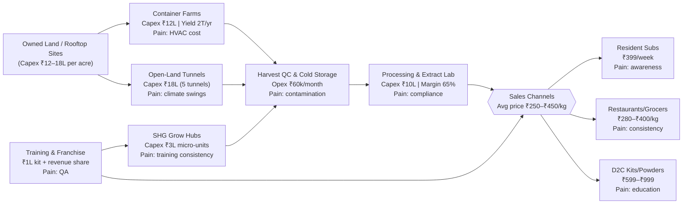

---
tags:
  - life/ideas
  - research/mushroom
date: 2025-11-11
---

# 2025-11-11 Mushroom Farming Brainstorm

## Why Now
- Rising demand for functional mushrooms (lion’s mane, reishi) in India’s wellness and F&B segments.
- Mushrooms can pair with SkyLoft pods or operate standalone in controlled micro-farms (shipping containers, unused basements).
- Telangana has agri-subsidies for mushroom units; Hyderabad restaurants want local premium supply.

## Opportunity Snapshot
| Segment | Demand Trend | Current Supply Gaps |
| --- | --- | --- |
| Gourmet mushrooms (shiitake, oyster, portobello) | Premium restaurants, cloud kitchens, high-end grocers; CAGR >15% | Most imports or trucked from Himachal/Maharashtra; freshness issues |
| Functional powders | D2C supplements, smoothies, coffee alternatives | Nascent; mostly imported extracts |
| Ready-to-cook kits | Middle-class hobbyists, health influencers | Limited local brand presence |

## Model Ideas
1. **Container Mushroom Farms** – 40 ft containers retrofitted with climate control on apartment rooftops. Pair with SkyLoft for hyperlocal supply.
2. **Community Grow Hubs** – Train peri-urban women’s SHGs to operate small-scale farms; central brand collects, quality-checks, and sells under a single label.
3. **Functional Extract Lab** – Partner with nutraceutical labs to turn lion’s mane/reishi harvests into powdered capsules for urban wellness stores.
4. **Open-Land Climate Tunnels** – Use leased peri-urban plots (1–2 acres) to build low-cost polyhouse tunnels with evaporative cooling. Suitable for oyster/button mushrooms with partial automation.

### Business Model Flow (Mermaid)

## Key Metrics
- Capex per container farm: ~₹12L (HVAC, racks, sensors).
- Yield: 1.5–2 tons/year/container for oyster mushrooms.
- Selling price: ₹220–₹320/kg wholesale; ₹450/kg direct.
- Breakeven: ~14 months at 60% capacity utilization.

### Open-Land Tunnel Economics
- Land lease: ₹1.2L/year for 1-acre peri-urban plot (Medchal example).
- Polyhouse setup: ₹18L for 5 tunnels (each 300 m²) with humidifiers/foggers and blackout curtains.
- Production: ~12 tons/year (oyster + milky mushrooms).
- Revenue: ₹30–36 L/year selling at ₹250–₹300/kg to restaurants + retail.
- Opex: ₹10L/year (labor, substrate, utilities, logistics). Gross margin ~55%.
- Payback: ~2.3 years (capex ₹18L + initial working capital ₹3L).

### Business Model Breakdown
| Layer | Description | Revenue | Cost focus | Notes |
| --- | --- | --- | --- | --- |
| Farming assets | Container pods, open-land tunnels, SHG micro-farms | Sale of fresh mushrooms (B2B/B2C) | Capex, climate control, substrate | Blend assets to hedge seasonality |
| Processing & R&D | Drying, powdering, extracts | Value-added products (capsules, coffee mixes) | Lab setup, food safety compliance | Higher margins, requires certifications |
| Distribution | Subscription boxes, gourmet stores, online D2C | Delivery fees, bundle pricing | Cold chain, marketing | Use existing farm-to-table partners |
| Training & Franchise | Offer turnkey kits / SOP training for SHGs | Franchise fee + offtake agreement | Trainer salaries, QA team | Expands supply without owning land |

### Financial Metrics Snapshot (Combined Approach Year 2)
- Assets: 4 container farms + 1 open-land tunnel cluster.
- Capex: Containers ₹48L + tunnels ₹18L + processing unit ₹10L = ₹76L.
- Annual revenue: Containers 8 tons @ ₹450/kg = ₹36L; tunnels 12 tons @ ₹280/kg = ₹33.6L; value-added products ₹20L; training/franchise ₹8L → **₹97.6L**.
- Opex: Labor ₹18L, substrate/materials ₹14L, utilities ₹9L, logistics/marketing ₹10L, QA/process ₹6L → **₹57L**.
- EBITDA: ~₹40L (41%). Breakeven on total capex ≈ 24 months.
- Funding mix: 30% promoter equity, 40% agri-term loan (NABARD), 30% grant/subsidy (Telangana horticulture).

| Metric | Containers (4 units) | Open-Land Tunnels (5 tunnels) | Value-Add/Training | Combined Notes |
| --- | ---: | ---: | ---: | --- |
| Capex | ₹48L | ₹18L | ₹10L (processing + training infra) | ₹76L total |
| Annual Output | 8 tons premium mushrooms | 12 tons oyster/milky | 5 tons equivalent (powders/kits) | 25 tons equivalent |
| Revenue | ₹36L (₹450/kg avg) | ₹33.6L (₹280/kg) | ₹28L (products + franchise fees) | ₹97.6L |
| Gross Margin | 60% | 50% | 65% | Weighted ~57% |
| Monthly Opex | ₹1.6L (labor, energy, substrate) | ₹0.8L | ₹0.65L | ₹3.05L |
| Payback | 18 months | 28 months | 20 months | Portfolio breakeven ~24 months |
| Funding Source | Equity + equipment loan | Agri loan + subsidy | Grant + revenue reinvest | Diversified to reduce risk |

## Owned Land Implementation Steps
1. **Site Assessment**
   - Soil/land quality, water access, power availability.
   - Structural evaluation for container placement (if rooftop) or leveling for tunnels.
2. **Design & Permitting**
   - Layout for container pods + tunnel clusters.
   - Apply for horticulture subsidies, pollution board NOC, food safety registration.
3. **Infrastructure Build**
   - Install tunnels (polyhouse frames, foggers), container conversions (HVAC, racks).
   - Set up central cold room and processing shed.
4. **Operations Setup**
   - Hire/train agronomist + SHG teams, establish substrate supply chain, implement IoT monitoring.
5. **Pilot & Iterate**
   - Run first crop cycle, monitor contamination, adjust SOP, lock in anchor buyers (restaurants, grocers).
6. **Scale & Franchise**
   - Offer franchise kits or revenue-share to SHGs, onboard more land plots, expand processing capacity.

## Risks & Questions
- Contamination control: need SOP + HEPA filtration.
- Cold chain for delivery: partner with existing farm-to-table logistics.
- Market education for functional mushrooms: require influencer + nutritionist tie-ins.

## Next Research Steps
1. Map Hyderabad buyers (restaurants, organic stores) and current suppliers.
2. Study Telangana agri subsidies or NABARD schemes for mushroom units.
3. Draft container farm layout + integration plan with SkyLoft pods.
