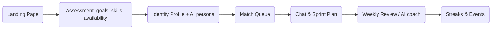
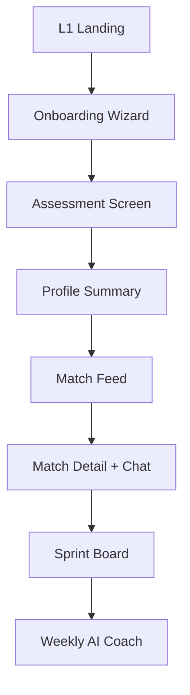

---
tags:
  - life/ideas
  - journal/jarvis
date: 2025-11-13
topic: ai-driven-partner-matching-hustle
region: India
---

# 2025-11-13 Jarvis Daily Idea — HustleMate (AI Partner Matching for Builders)

## Topic
- Sector: Creator economy / Professional networking / AI matchmaking
- Why now: Solo builders and side-hustlers spend months searching for co-founders or accountability partners. Generic dating apps or LinkedIn groups aren’t optimized for work styles, schedules, or goals. An AI-driven partner-matching platform tailored to Indian builders can accelerate projects and reduce burnout.

## Concept Synopsis
- Idea name: HustleMate
- One-liner: AI matchmaking for accountability partners, co-founders, or study buddies, blending psychological profiles, availability, and domain goals.

## Business Model & Monetization
- Core revenue: Subscription (₹499/month) for unlimited matches + weekly AI coaching summaries; pay-per-match (₹99) for casual users; corporate plans for startup accelerators.
- Value-add: Premium background checks, NDAs, project sprint templates, community events.
- Scaling levers: Partnerships with coworking spaces, accelerators, ed-tech communities; referral rewards.

## Audience Mapping
| Segment                      | Value Prop                           | Pricing / Access        | Adoption Barriers    |
| ---------------------------- | ------------------------------------ | ----------------------- | -------------------- |
| Students / Lower-income      | Find study/accountability partners   | ₹99/match, scholarships | Trust, affordability |
| Middle-class professionals   | Side-hustle accountability           | ₹499/month subscription | Time commitment      |
| Upper-middle founders        | Co-founder matching, sprint coaching | ₹1,499/month            | Data privacy         |
| Ultra-rich / serial builders | Curated retreats + vetted partners   | ₹50k/year concierge     | High expectations    |

## Competitive Landscape
| Player | Geography | Pricing | Differentiator | Gap |
| --- | --- | --- | --- | --- |
| Lunchclub | Global | Free | Serendipitous network matches | Not goal-oriented or India-specific |
| CoFoundersLab | Global | Premium | Founders network | Weak India presence |
| Bumble Bizz / LinkedIn | Global | Free | Large user base | Not optimized for accountability |
| Local WhatsApp/Discord groups | India | Free | Community vibes | Hard to vet, poor matching |

## Regulatory & Ease-of-Business
- Need data privacy compliance (IT Act, PDP Bill).
- Offer clear terms around NDAs, IP sharing.
- Optional KYC for premium tiers to build trust.

## Operational Readiness
- AI model: Use personality + goal assessments (Big Five, work styles), schedule availability, domain expertise.
- Human curation team ensures quality matches, handles disputes.
- Product features: In-app chat, sprint planning templates, weekly check-ins.

## Go-To-Market Funnel
| Channel | CAC target | LTV | Retention lever |
| --- | --- | --- | --- |
| Twitter/LinkedIn ads | ₹300 | ₹3k/year | Weekly AI reports, streaks |
| Accelerator partnerships | ₹2k per cohort | ₹10k/year | Provide matching as a service |
| Coworking spaces | Revenue share | ₹5k/year per location | On-site events |
| Influencer campaigns | ₹500/signup | ₹2.5k/year | Success stories |

## Market & Population Metrics
- TAM: India’s independent worker/side-hustler base ~35M; SAM for builder-focused matching ~3M (Tier 1/2 cities).
- Metro focus: Bengaluru, Hyderabad, Mumbai, Delhi NCR; combined ~8M potential users with disposable income ₹50k+.
- Emotional drivers: desire for accountability, loneliness in building alone, need for complementary skills.

### City Deep Dive — Hyderabad Builder Scene
- Tech + creative communities growing in HITEC City, Gachibowli, Sainikpuri.
- Key venues: T-Hub, WeWork, community cafes; potential for offline mixers.
- Population: 1.2M knowledge workers; 30% report seeking side-hustle partners.

## Finance & Valuation Notes
- Capex: Product development (₹25L) + AI model (₹10L) + initial curation team.
- Opex: Team salaries ₹4L/month, infra ₹1L, marketing ₹2L.
- Break-even: 4,000 subscribers @ ₹499/month (₹20L revenue) covers opex by Month 12.
- Valuation lens: SaaS/marketplace hybrid; aim for 4× ARR once hitting ₹5Cr run rate.

### Financial Breakdown
| Item | Amount | Notes |
| --- | ---: | --- |
| Capex | ₹35L | Product, AI training, legal |
| Monthly Opex | ₹7L | Salaries, infra, marketing |
| Revenue Streams | Subscriptions, matches, corporate plans | 60% margins |
| Breakeven | 12 months | 4k subs or mix of subs + B2B |

## Execution Steps
1. Build assessment + matching engine MVP; pilot with 200 Hyderabad/Bengaluru builders.
2. Host “Partner Jam” events in coworking hubs; gather feedback.
3. Launch premium concierge tier with background checks/NDA templates.

## Risks & Countermeasures
- Trust issues: implement optional KYC, NDAs, rating system.
- Ghosting: streaks, penalties for no-shows, AI reminders.
- Privacy/IP leakage: legal templates, education, encrypted chat.

## Jarvis Commentary
- Risks: building enough trust and liquidity early; AI matches must feel accurate or churn spikes.
- Differentiators: builder-specific assessments, accountability features, India-first community integrations.
- Next prompt: “Jarvis, design an onboarding funnel for HustleMate that ensures high-quality data from day one.”

---

## Product Design Deep Dive

### User Personas
| Persona | Goals | Key Features Needed |
| --- | --- | --- |
| Solo Developer | Accountability, code feedback | Skill tagging, weekly sprint reminders |
| Designer-turned-founder | Find technical co-founder | Matching by domain complement, NDA templates |
| Student Hustler | Study partner, small gigs | Budget-friendly matches, in-app chat, safety |
| Serial Builder | Vetted partners for new ventures | Background checks, concierge service |

### Experience Flow

### Feature Backlog
- **Assessment Engine**: 15-question mix (skills, work style, availability, timezone, personality).
- **Match Confidence Score**: Transparent breakdown (skills fit, schedule overlap, goal alignment).
- **Sprint Templates**: 2-week plan templates for accountability partners.
- **AI Coach**: Weekly summary of commitments + nudges.
- **Verification Layer**: Optional KYC, LinkedIn/GitHub sync, rating system.
- **Event Layer**: Monthly “Hustle Jam” mixers with offline verification.

### Business Scope & Metrics
| Metric | Target | Notes |
| --- | ---: | --- |
| Subscribers (Month 12) | 4,000 | Breakeven threshold |
| Matching accuracy | ≥80% positive feedback | Survey after 3 conversations |
| Retention (3-month) | 60% | Driven by weekly AI coach & streaks |
| CAC | ₹300 self-serve, ₹2k B2B | Balanced acquisition mix |
| LTV | ₹3k/year self-serve, ₹12k/year premium | Upsell concierge tier |

### Revenue Streams Breakdown
| Stream                  |       Price | % Contribution (Yr 1 estimate) |
| ----------------------- | ----------: | -----------------------------: |
| Individual subscription |  ₹499/month |                            55% |
| Pay-per-match           |   ₹99/match |                            15% |
| Premium/concierge       | ₹1,499–₹50k |                            20% |
| B2B partnerships        |      Custom |                            10% |

### Product Roadmap (High-Level)
1. **MVP (Months 1–3)** – Build assessment + simple matching, beta in Hyderabad.
2. **AI Enhancement (Months 4–6)** – Introduce confidence scores, AI coach, streaks.
3. **Trust & Scale (Months 7–12)** – Add KYC, background checks, offline events, corporate plans.
4. **Expansion (Year 2)** – Tier-2 cities, niche verticals (Web3, creators), premium retreats.

### Risks & Mitigation (Product Specific)
- **Bad Matches → Churn**: Provide transparent feedback loops so users know why they matched; allow quick rematch tokens.
- **Privacy/IP leakage**: Encrypted chat + NDA templates + education hub on safe collaboration.
- **Ghosting**: Streak penalties, reward active partners with visibility boost.

Use this section as the blueprint when moving into design sprint or pitching to early investors.

---

## Prototype Blueprint

### Screen Map

### Screen Details
1. **Landing (L1)**: Hero copy “Find your HustleMate”, CTA buttons (“Take Assessment”, “See Success Stories”). Testimonials from builders in Hyd/Bengaluru.
2. **Onboarding Wizard**: 3-step slider explains process: (1) Assess, (2) Match & Chat, (3) Execute sprints.
3. **Assessment Screen**: Multi-step form (skills, goals, availability, personality sliders). Progress bar + save option.
4. **Profile Summary**: Displays AI persona (e.g., “Product Architect – Strategic Night Owl”), highlights goals, availability calendar, optional verification badges.
5. **Match Feed**: Card stack showing matches with confidence score, overlapping goals, schedule overlap. Buttons: “Chat”, “Pass”, “Later”.
6. **Match Detail + Chat**: Right pane shows profile details + NDA quick toggle, left pane chat + “Plan Sprint” button.
7. **Sprint Board**: Kanban view for Week 1 & Week 2 tasks, both partners can assign actions and deadlines.
8. **Weekly AI Coach**: Recap screen summarizing commitments, missed tasks, suggestions; push notifications for accountability.

### Low-Fidelity Layout Notes
- **Color palette**: calming tech blues + bright accent for match confidence.
- **Typography**: Clean sans-serif, highlight key metrics (confidence %, overlapping hours).
- **Microcopy**: Friendly, builder-toned (“Ship together”, “Sync up”).

### Prototype Interaction Flow
1. User completes assessment → AI persona displayed with identity quote.
2. Match feed shows 3 matches at a time; swiping left/right logs preference.
3. Selecting “Chat” auto-opens suggested sprint template.
4. After a week, AI coach prompts feedback; low rating auto-triggers new match tokens.

### Next Steps
- Build clickable Figma prototype covering the 8 key screens.
- Run usability test with 10 Hyderabad builders; collect metrics (time to complete assessment, clarity of match cards).
- Iterate before engineering sprint.

---

## Persona Spotlight — “The 6’2 Deloitte Consultant”

**Profile**: Athletic, disciplined senior consultant at Deloitte, juggling high-intensity work, evening workouts, and passive-income experiments (startups, content, investments). Social time is scarce; paying premiums on random co-founder platforms yielded low-quality matches. Needs a partner who respects his schedule, ambition, and communication style.

### Matching Approach
1. **Assessment Inputs**
   - Work style: structured daytime, creative late evenings.
   - Goals: build passive income products (SaaS, newsletter, niche services).
   - Preferences: partners who ship weekly, fitness-oriented, clear communicators.
   - Non-negotiables: respects confidentiality, doesn’t expect constant chatter during Deloitte hours.
2. **AI Persona Output**
   - “Strategic Night Owl — ships after 9 pm, thrives on accountability dashboards, prefers weekly retros.”
3. **Match Criteria**
   - Complementary skills (e.g., product marketer or automation engineer).
   - Overlapping time windows (early mornings / late evenings).
   - Fitness or disciplined routine to align lifestyles.
4. **Pricing Justification**
   - Standard subscription (₹499) + optional concierge (₹1,499) still cheaper than wasted hours on dead-end matches.
   - Option to pay-per-match for testing before upgrading.

### Communication Workflow
| Step         | Mechanism                                                                  | Purpose                                         |
| ------------ | -------------------------------------------------------------------------- | ----------------------------------------------- |
| Match intro  | AI-generated summary with common goals + schedule overlap                  | Sets context quickly                            |
| First chat   | Guided script (“Why are you building?”, “What’s your current experiment?”) | Filters misaligned expectations                 |
| Sprint setup | In-app template for 2-week experiment                                      | Ensures both commit to deliverables             |
| Weekly retro | AI coach email + optional call                                             | Keeps accountability without constant messaging |
| Review       | Rating + reflection                                                        | Feeds future match accuracy                     |

### Why This Solves the “Premium Pain”
- **Curated pool**: Only builders who completed assessment + optional KYC are visible.
- **Transparent matching**: See exactly why someone was matched (skills, availability).
- **Structured communication**: Built-in scripts and sprint templates remove awkwardness, reduce waste.
- **Identity fit**: Filters for fitness/discipline align with your lifestyle, avoiding mismatched priorities.

If you (the Deloitte consultant) test HustleMate, start with the standard sub, run one 2-week sprint, then decide if concierge (background checks, on-call match managers) is worth it. The platform’s value lies in reducing trial-and-error and aligning partners on work ethic from day one.

### Why Others Swipe Right on You
| Opposite Persona | What They Seek | Why You Appeal | How HustleMate Shows It |
| --- | --- | --- | --- |
| Product Marketer | Reliable technical partner with corporate rigor | Deloitte pedigree, disciplined schedule, fitness lifestyle (signals consistency) | Profile highlights work track record, availability calendar, habit streaks |
| Automation Engineer | Partner to handle client relations + strategy | You bring consulting + finance chops, passive-income experiments | AI persona surfaces your goal stack + finance/planning strength |
| Student Creator | Mentor-like accountability with high standards | Your experience, structured approach, but still open to hustle | Sprint templates show you can coach + execute |
| Designer-Founder | Wants someone who can stress-test ideas + manage budgets | You understand budgets (Blackrock), systems (Atomic Habits), and can co-invest | Match card includes budget discipline score, identity cues |

> HustleMate isn’t just matching data; it communicates your story so the other side sees the value proposition—like pitching a business partner. Profiles show proof (habit streaks, availability, verified skills) so it feels like a well-framed deal, not a blind date.

### India-Specific Compatibility Filters
- **Caste / Community / Religion**: Not all users want to filter by this, but HustleMate can offer optional filters (visible only to those who opt in). That way, someone who needs a partner aligned with family expectations can signal it upfront without forcing it on everyone.
- **Family Alignment Meter**: Quick checklist for values such as “family involvement level,” “willingness to relocate,” “festivals celebrated.” Helps ensure both sides know the cultural expectations early.
- **Long-term Partnership Outlook**: Include prompts about relationship/marriage views (monogamy, timelines, openness to relocation/extended family). Users can set “deal breakers” so matches know the non-negotiables.
- **Trust & Longevity Signals**: Show habit streaks, commitment history, and references to demonstrate reliability—important when marriages/partnerships are viewed as business deals with high stakes.
- **Conflict Resolution Preferences**: Add scenario questions (“How do you handle disagreements?”). Provide compatibility scoring on communication styles to prioritize sustainable partnerships.

By acknowledging cultural filters (caste, religion, family expectations) alongside modern lifestyle metrics, HustleMate can serve Indian users realistically: appealing identities plus transparent value propositions make swiping feel like evaluating a long-term partnership rather than gambling on premium apps.

---

## Full Overview & Analysis

### Summary Table
| Aspect | Detail |
| --- | --- |
| Product | HustleMate — AI-powered partner/accountability matching for builders |
| Users | Solo devs, designers, professionals, students, serial builders |
| Region | India focus (Tier 1/2 cities), optional caste/community filters |
| Monetization | Subscriptions, pay-per-match, concierge, B2B |
| Key Differentiators | Builder assessments, sprint templates, identity cues, cultural filters |

### Pros
- **Targeted Matching**: Assessment + AI personas tailor matches by skills, goals, availability, cultural preferences.
- **Trust-building features**: Optional KYC, background checks, NDAs, streak tracking boost reliability.
- **Structured workflows**: Sprint boards, AI coach reduce friction, make partnerships actionable.
- **Cultural adaptability**: Optional caste/religion filters, family alignment meters respect Indian realities.
- **Scalable revenue mix**: Individual subs plus corporate/concierge offerings diversify income.

### Cons / Risks
- **Liquidity challenge**: Need critical mass in each city to ensure quality matches.
- **Data privacy**: Sensitive info (caste, relationship views) requires strong encryption/compliance.
- **User fatigue**: Assessments and sprint templates may feel heavy if not streamlined.
- **Ghosting/conflicts**: Even with systems, human inconsistency can hurt reputation.
- **Price sensitivity**: Some segments may resist paying for yet another subscription.

### Opportunities
- Partner with coworking spaces, accelerators, ed-tech platforms to seed liquidity.
- Layer in AI-generated conversation starters or project ideas to keep matches moving.
- Offer “mentor” mode for experienced professionals to guide students/creators and earn rewards.
- Build “relationship readiness scores” that signal how committed each user is, reducing wasted time.

### Threats
- Large platforms (LinkedIn, Bumble) could build similar vertical features.
- Cultural backlash if filters are misused or seen as discriminatory.
- Regulatory shifts in data privacy or matchmaking businesses.

### Action Items
1. Validate demand with 100 interviews (builders, founders, students, professionals).
2. Prototype onboarding + match feed; run usability tests with real personas (including the Deloitte consultant profile).
3. Secure partnerships with 2 coworking spaces and 1 accelerator to seed early users.
4. Develop clear privacy + cultural guidelines to avoid misuse of sensitive filters.
5. Define success metrics (match satisfaction ≥80%, retention ≥60% at 3 months) before scaling marketing spend.

This overview keeps HustleMate aligned with every parameter we discussed—product design, persona narratives, cultural considerations, financial scope, and next steps. Use it as the master reference for pitching, prototyping, and roadmap planning.
