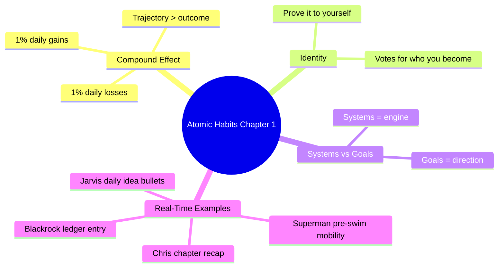

---
tags:
  - life/books
  - book/atomic-habits
author: James Clear
agent: Chris
status: in-progress
---

# Atomic Habits Journal

Chris uses this note to track chapter summaries, workflows, and action plans that cast you as the hero of the habit story.

## Tracking Table
| Chapter | Title | Status | Last Reviewed |
| --- | --- | --- | --- |
| 1 | The Surprising Power of Atomic Habits | ✅ Summarised | 2025-11-12 |
| 2 | How Your Habits Shape Your Identity | ✅ Summarised | 2025-11-15 |
| 3 | How to Build Better Habits in 4 Simple Steps | ⏳ Pending |  |
| 4 | The Man Who Didn’t Look Right | ⏳ Pending |  |
| ... | ... | ... | ... |

---

## Chapter 1 — The Surprising Power of Atomic Habits

### Hero Narrative (Real-Time Lens)
Picture yourself as the systems architect of “Mission Growth HQ.” Every Life System (fitness, finance, ideas, etc.) is a reactor room powered by habit modules. Instead of chasing a single heroic event, you engineer micro-upgrades: a 5-minute pre-swim mobility session, a ledger entry after every spend, a three-bullet ideation before Jarvis spins up. These modules click into the reactor, compounding power daily. When one fails, you don’t blame yourself; you diagnose the module, tweak it, and reinsert.

### Mind Map (Mermaid)

### Core Summary (Detailed)
1. **Atomic change compounds**: Improving by 1% daily means you’re 37x better in a year; neglecting 1% daily rots the system. The compounding curve works both ways, so aim for positive drift.
2. **Systems trump goals**: Goals set the target (lose fat, save ₹90k, write ideas). Systems are the daily loops that inch you there. Without systems, goals are hollow.
3. **Identity is forged by habits**: Each rep is a “vote” for your identity. The question isn’t “Can I reach my goal?” but “What small evidence today proves I AM the type of person who…?”

### Workflow (Step-by-Step)
1. **Map Anchors**: List existing cues (wake-up, coffee, Gravl log, swim, ledger). These become docking ports for new habits.
2. **Attach Micro Habit**: Choose the smallest action tied to identity (hydrated athlete, disciplined investor, prolific creator).
3. **Run 1% Evaluations**: At day end, ask “Did I move 1% toward/away from identity X?” If away, redesign the habit environment.
4. **Visual Scoreboard**: Use a simple tracker (✅/⚪) inside each Life System note. Missing once is a blip; missing twice demands a fix.

### Real Examples (Live Mapping)
| Life System | Atomic Habit | Cue | 1% Win Evidence |
| --- | --- | --- | --- |
| Fitness/Superman | 5-min thoracic + hip opener | Before swim goggles on | Logged in swim note ✅ |
| Finance/Blackrock | Record spend instantly | Payment notification | Ledger entry count matches bank SMS |
| Ideas/Jarvis | Write 3 sparks | Finish lunch | Jarvis daily idea file filled |
| Books/Chris | Log one insight per chapter | Close the book | Tracking table shows ✅ |

### Chris Notes
- Identity line: “I’m the systems architect who feeds every Life System with clean power daily.”
- Diagnostic question when slipping: “How can I make the next action 1% easier or more obvious?”
- Homework for Chapter 2: list identity statements for each domain (Athlete, Investor, Builder, Reader) before reading.

---

## Chapter 2 — How Your Habits Shape Your Identity

### Hero Narrative (Identity Switchboard)
Chapter 2 hands you the identity switchboard for Mission Growth HQ. Every lever is a statement (“I am a resilient athlete,” “I am a precise allocator,” “I am an inventive builder”) wired to a micro habit that proves it true. When Superman, Blackrock, Jarvis, or Chris asks for an update, you are not performing a task—you are casting a vote for who you insist on being. Identity becomes the north star that keeps scattered life-systems coherent.

### Core Summary
1. **Outcomes ← Processes ← Identity**: Goals are the outer ring, identity sits at the core. Changing who you believe you are makes process tweaks stick.
2. **Evidence Loop**: Habits provide proof of identity. Two or three clean reps are enough to start trusting the new story.
3. **Double-Edged Beliefs**: Old narratives (“I’m inconsistent,” “I overspend when stressed”) keep bad loops alive. Rewrite them with specific counters.

### Live Identity Matrix
| Life System | Identity Statement | Sabotaging Cue | Micro-Correction |
| --- | --- | --- | --- |
| Fitness — Superman | “I’m the tall athlete who protects joints before power.” | Skipping mobility when rushed | 90-second hip CARs before touching a barbell |
| Swimming — Superman | “I’m a relaxed, rhythmic freestyler.” | Stiff shoulders after work day | Add doorframe pec stretch + snorkel drill log |
| Finance — Blackrock | “I’m the allocator who reconciles same day.” | UPI ping while multitasking | Pause call, record ₹ figure + emotion tag |
| Ideas — Jarvis | “I’m the urban scout who ships one market scan daily.” | Lunch scroll hijack | Trigger: finish meal → open Jarvis template |
| Books — Chris | “I’m the strategist who extracts one play per chapter.” | Reading when fatigued | Use voice memo summary, transcribe later |

### Workflow Extracted
1. **Name the New Story**: For each Life System, write the identity line in first person and pin it at the top of the note (done for Superman, Jarvis, Blackrock).
2. **Collect Micro Proof**: Use existing trackers (Swim log, Budget Analysis, Jarvis daily idea) to highlight the smallest visible proof each day.
3. **Audit Conflicts**: During evening shutdown, scan for any action that contradicted the identity. Re-plan tomorrow’s cue so it is harder to miss (e.g., place ledger tab beside dinner plate).
4. **Broadcast Alignment**: When talking to each agent, lead with the identity (“As the allocator… here’s today’s ledger”). The language reinforces the loop.

### Real-Time Action Plan
- **Morning**: Before gym, read the Fitness + Swimming identity statements out loud.
- **Midday Finance**: When a transaction hits, jot the emotion in Blackrock’s ledger so the allocator story stays factual, not fuzzy.
- **Evening Idea/Diet Log**: Tie Jarvis entry + diet reflection to “inventive builder who eats for performance,” making diet compliance part of creative identity.
- **Weekend Review**: Color the weekly graph nodes by identity (athlete, investor, builder) to keep the Obsidian graph clean and purpose-driven.

### Chris Notes
- Identity check mantra: “Proof before perfection.” Two clean reps per domain keep confidence high.
- When motivation dips, ask “Which identity hasn’t received a vote today?” Then give it the smallest action possible.
- Next chapter prep: inventory cues, cravings, responses, rewards inside each Life System for the 4-step loop.

---

### Real-Time Narrative — Identity in Motion
| Time Block | Real Situation | Identity Lens | Habit Proof | Adjustment if Missed |
| --- | --- | --- | --- | --- |
| 6:30 AM | Alarm rings after 5-hour sleep | Athlete/Architect | Drink water, quick spine opener, review Superman block | If skipped, shorten swim volume by 10% and prioritize recovery |
| 10:00 AM | Deloitte call spills over, UPI ping hits | Precise Allocator | Mute call for 60 seconds, log expense + emotion tag | If delayed, add `#late-log` and reconcile at lunch to close loop |
| 2:00 PM | Cafeteria banter tempts doom-scroll | Inventive Builder | Fire Jarvis note, list 3 sparks, pick one to expand | If phone steals hour, create “idea debt” sticky for evening |
| 5:00 PM | Shoulder fatigue before swim | Relaxed Freestyler | Doorway stretch + snorkel drill recorded in swim note | If ignored, document stiffness + redesign warm-up next day |
| 9:30 PM | Family chat + OTT urge | Strategist Reader | Share one win, jot Atomic Habits insight, lights out by 10:30 | If binge happens, log identity vote missed and plan buffer night |

This table mirrors real friction points so Chris can remind you: identity isn’t abstract, it’s how you respond at each of these checkpoints.

### Lifestyle Quest — Defender + House (Identity Stack)
- **North-Star Identity**: “I’m the disciplined builder who funds a ₹1.32 cr Defender and a ₹2.2 cr urban sanctuary without sacrificing freedom.” Every habit this quarter proves that statement.
- **Target Breakdown**:
  - Defender 110 + Insurance/registration 22 = **₹1.32 cr** on-road.
  - House down payment 15% (~₹33 L), interiors/closing ₹17 L, contingency ₹5 L → **₹55 L cash** plus loan runway.
- **Morning Vote (Superman)**: Use mobility + workout block to rehearse “strong body guards lifestyle assets.” If gym is missed, add 15‑minute walk reviewing property shortlist so the quest stays visible.
- **Midday Vote (Jarvis)**: Daily idea journal must include one monetization or efficiency spark (consulting upsell, IP product, rental arbitrage) tagged `#DefenderHouse`. Jarvis filters which concepts can realistically create ₹60–75k/month surplus over 24 months.
- **Evening Vote (Blackrock)**: Ledger close-out includes “Did today’s money behavior align with Defender/House runway?” Log micro-proof (₹3k set aside, impulse resisted). If no, document trigger and design friction for tomorrow.
- **Weekly Ritual**: Sunday night, review Real-Time narratives with Chris → highlight three identity wins feeding the lifestyle fund, one identity leak, and confirm next week’s Jarvis revenue experiment.

## Real-World Narrative (Interest Map)

This storyboard is not a fixed schedule but a menu of touchpoints you lean on to stay interested—work bursts, swimming, finance checks, movies, friend calls, idea hunts, partner search. Chris maps habits onto these touchpoints so they can snap into place whenever the activity occurs.

| Time | Scene | Identity Cue | Habit/Action | Outcome |
| --- | --- | --- | --- | --- |
| 6:00–7:00 | Wake, hydrate, plan day | Athlete/Architect | Drink 500 ml water, scan Fitness & Finance dashboards | Body primed, agenda set |
| 7:00–9:00 | Gym or swim | Athlete | Superman warm-up, log in Gravl | Strength + data captured |
| 9:00–12:00 | Deep work (coding/finance) | Builder/Investor | Pomodoro focus, ledger updates as payments hit | Progress on projects & Blackrock |
| 12:00–13:00 | Lunch + idea capture | Creator | Jarvis 3 bullets, review Atomic Habits note | Fresh ideas recorded |
| 13:00–17:00 | Hustle block (client calls, planning) | Operator | Use Atomic Habits cues to reset between tasks, note any friction | Sustainable energy |
| 17:00–18:00 | Swim or cardio flush | Athlete | Technique drills, log RPE | Recovery + data for Superman |
| 18:00–20:00 | Social/family/partner time | Connector | Share wins, discuss ideas, evaluate potential collaborators | Emotional fuel |
| 20:00–21:00 | Finance + idea review | Investor/Creator | Update ledger, check Budget Plan, tee up next day’s Jarvis topic | No loose ends |
| 21:00–22:00 | Wind-down + reading/movie | Reader/Explorer | Read Atomic Habits or watch a film mindfully; note one insight | Interest sustained |

### Two-Sided Coin Reflection
- **Side A (Momentum)**: Multiple domains firing—fitness, finance, ideas, learning. The system works when you show up for each micro module.
- **Side B (Risk)**: Overload from hustling without rest. Atomic Habits reminds us that missing once is fine; missing twice signals a system tweak. Build slack pockets (short walks, no-phone dinners) to keep the reactor stable.

Use this narrative when habits feel abstract; it shows exactly where each habit lives and how to adjust when real life (work, friends, partner search) shifts the schedule.

---

## Templates for Future Chapters

### Chapter X — {{Title}}
- **Hero Narrative**:
- **Core Summary**:
- **Workflow Extracted**:
- **Real-Time Action Plan**:
- **Chris Notes**:
