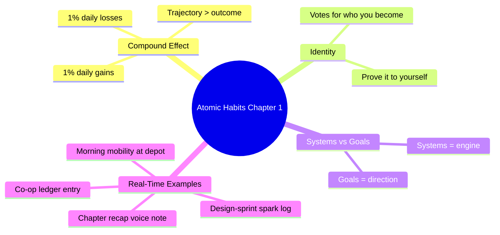

---
tags:
  - life/books
  - book/atomic-habits
author: James Clear
agent: Chris
status: in-progress
---

# Atomic Habits Journal

Chris uses this note to track chapter summaries, workflows, and action plans through third-person case studies so habits stay grounded in real-world contexts.

## Reader Profiles by Economic Band
| Band | How They Approach the Book | Real-Time Framework & Time Horizon |
| --- | --- | --- |
| Poor / Income-volatile | Use Atomic Habits to stabilise daily anchors (hydration, ledger jot, prospecting calls) that cost nothing. Focus on “5-minute wins” to protect energy before chasing income. | 1–2 week loops. Review habit board every Sunday evening to keep routines resilient despite shifting shifts or gigs. |
| Middle class / Salaried | Treat the book as an operating manual for juggling career, family, and side projects. Stack habits onto predictable cues (commute, lunch, bedtime) to reduce cognitive load. | Monthly sprint board with weekly check-ins; aim for 30-day evidence streaks that tie into savings, upskilling, and health. |
| Rich / Asset builders | Use chapters to professionalise routines around team leadership, asset reviews, and wellness so success compounds without burnout. | Quarterly “Habit OKR” with dashboard of identity votes; review at exec off-sites. |
| Ultra rich / Legacy planners | Apply frameworks to delegation, philanthropy, and longevity protocols. Focus on habits that preserve clarity, empathy, and stewardship. | Annual “Habit Council” with staff/family; run red-team reviews of loops each quarter to avoid complacency. |

### Real-Time Action Plan Snapshot
| Band | Immediate Next Step | Weekly / Monthly Cadence |
| --- | --- | --- |
| Poor / Income-volatile | Pick two anchor cues (wake-up, pre-shift) and attach 5-min habits (water + ledger jot). | Sunday: redraw 7-day habit board; celebrate any streak >3 days. |
| Middle class / Salaried | Create a “habit stack” card for commute/lunch/bed cues; start tracking 1% wins in each Life System note. | Weekly review: check trackers Monday morning; month-end share wins with accountability buddy. |
| Rich / Asset builders | Build a Habit OKR board (health, finance, leadership). Assign cues and visible rewards per loop. | Bi-weekly exec check-in on loop metrics; quarterly retreat to adjust cues/rewards. |
| Ultra rich / Legacy planners | Convene a mini Habit Council (family + chief of staff) to list keystone routines for stewardship and longevity. | Quarterly red-team review of loops; annual summit to ensure habits match legacy goals. |

## Tracking Table
| Chapter | Title | Status | Last Reviewed |
| --- | --- | --- | --- |
| 1 | The Surprising Power of Atomic Habits | ✅ Summarised | 2025-11-12 |
| 2 | How Your Habits Shape Your Identity | ✅ Summarised | 2025-11-15 |
| 3 | How to Build Better Habits in 4 Simple Steps | ✅ Summarised | 2025-11-20 |
| 4 | The Man Who Didn’t Look Right | ⏳ Pending |  |
| ... | ... | ... | ... |

---

## Chapter 1 — The Surprising Power of Atomic Habits

### Hero Narrative (Real-Time Lens)
Case study: Arjun, an operations lead running a multi-city logistics team, treats his “Habit Lab” like a control room. Each domain (health, budgeting, design research, community volunteering) is a reactor pod powered by tiny routines. Instead of waiting for dramatic breakthroughs, he installs 5-minute spine drills before long drives, logs every rupee through a co-op ledger, and jots three product sparks after lunch. When a pod flickers, he doesn’t blame himself; he debugs the module, adjusts the environment, and restarts the loop.

### Mind Map (Mermaid)

```mermaid
mindmap
  root((Atomic Habits Chapter 1))
    Compound Effect
      1% daily gains
      1% daily losses
      Trajectory > outcome
    Identity
      Prove it to yourself
      Votes for who you become
    Systems vs Goals
      Goals = direction
      Systems = engine
    Real-Time Examples
      Morning mobility at depot
      Co-op ledger entry
      Design-sprint spark log
      Chapter recap voice note
```

### Core Summary (Detailed)
1. **Atomic change compounds**: Improving by 1% daily means you’re 37x better in a year; neglecting 1% daily rots the system. The compounding curve works both ways, so aim for positive drift.
2. **Systems trump goals**: Goals set the target (lose fat, save ₹90k, write ideas). Systems are the daily loops that inch you there. Without systems, goals are hollow.
3. **Identity is forged by habits**: Each rep is a “vote” for your identity. The question isn’t “Can I reach my goal?” but “What small evidence today proves I AM the type of person who…?”

### Workflow (Step-by-Step)
1. **Map Anchors**: List existing cues (wake-up, coffee, Gravl log, swim, ledger). These become docking ports for new habits.
2. **Attach Micro Habit**: Choose the smallest action tied to identity (hydrated athlete, disciplined investor, prolific creator).
3. **Run 1% Evaluations**: At day end, ask “Did I move 1% toward/away from identity X?” If away, redesign the habit environment.
4. **Visual Scoreboard**: Use a simple tracker (✅/⚪) inside each Life System note. Missing once is a blip; missing twice demands a fix.

### Case Examples (Live Mapping)
| Domain | Atomic Habit | Cue | 1% Win Evidence |
| --- | --- | --- | --- |
| Logistics health | 5-min thoracic + hip opener | Before stepping into truck bay | Entry noted in depot wellness sheet |
| Cooperative finance | Record spend instantly | Payment notification | Ledger matches SMS count |
| Design research | Write 3 sparks | Finish lunch | Idea file stamped daily |
| Reading guild | Log one insight per chapter | Close the book | Tracking table shows ✅ |

### Chris Notes
- Identity line: “I’m the systems architect who feeds every Life System with clean power daily.”
- Diagnostic question when slipping: “How can I make the next action 1% easier or more obvious?”
- Homework for Chapter 2: list identity statements for each domain (Athlete, Investor, Builder, Reader) before reading.

### Key Ideas
- Compounding favors the consistent technician, not the occasional hero.
- Systems run the show; goals are merely coordinates.
- Each habit vote shapes identity—track the votes, not just tasks.

### Mindset Shift
- From “Did I hit the goal?” to “Did I feed the system today?”

### Tools & Exercises
- 1% Win log in each Life System note; emoji-based tracker for quick review.
- Evening “Trajectory Check” question pinned in Obsidian.

### Habits to Add / Remove
- Add: 5-minute reactor review each morning (scan Life Systems).
- Remove: Waiting until end-of-week to log habits—log same day.

### Quotes
> “You do not rise to the level of your goals; you fall to the level of your systems.” — James Clear

### Insights
- Graph coloring trick keeps Obsidian links uncluttered and identity-aligned.

### 30-Day Plan
| Week | Focus | Proof |
| --- | --- | --- |
| 1 | Track 1% wins daily | Screenshot of tracker |
| 2 | Run nightly Trajectory Check | Journal entries |
| 3 | Adjust any habit missed twice | Note in Life Systems Hub |
| 4 | Share learnings with agents | Recap bullet |

### Weekly Tracker
| Week | Systems fed? | Notes |
| --- | --- | --- |
| 1 |  |  |
| 2 |  |  |
| 3 |  |  |
| 4 |  |  |

### Review
- Wins: Micro trackers installed inside Superman, Jarvis, Blackrock notes.
- Gaps: Weekend logging still spotty; set Sunday reminder.
- Carry-forward: Enter Chapter 2 with identity statements ready.

---

## Chapter 2 — How Your Habits Shape Your Identity

### Hero Narrative (Identity Switchboard)
Chapter 2 hands you the identity switchboard for Mission Growth HQ. Every lever is a statement (“I am a resilient athlete,” “I am a precise allocator,” “I am an inventive builder”) wired to a micro habit that proves it true. When Superman, Blackrock, Jarvis, or Chris asks for an update, you are not performing a task—you are casting a vote for who you insist on being. Identity becomes the north star that keeps scattered life-systems coherent.

### Core Summary
1. **Outcomes ← Processes ← Identity**: Goals are the outer ring, identity sits at the core. Changing who you believe you are makes process tweaks stick.
2. **Evidence Loop**: Habits provide proof of identity. Two or three clean reps are enough to start trusting the new story.
3. **Double-Edged Beliefs**: Old narratives (“I’m inconsistent,” “I overspend when stressed”) keep bad loops alive. Rewrite them with specific counters.

### Live Identity Matrix
| Life System | Identity Statement | Sabotaging Cue | Micro-Correction |
| --- | --- | --- | --- |
| Fitness — Superman | “I’m the tall athlete who protects joints before power.” | Skipping mobility when rushed | 90-second hip CARs before touching a barbell |
| Swimming — Superman | “I’m a relaxed, rhythmic freestyler.” | Stiff shoulders after work day | Add doorframe pec stretch + snorkel drill log |
| Finance — Blackrock | “I’m the allocator who reconciles same day.” | UPI ping while multitasking | Pause call, record ₹ figure + emotion tag |
| Ideas — Jarvis | “I’m the urban scout who ships one market scan daily.” | Lunch scroll hijack | Trigger: finish meal → open Jarvis template |
| Books — Chris | “I’m the strategist who extracts one play per chapter.” | Reading when fatigued | Use voice memo summary, transcribe later |

### Workflow Extracted
1. **Name the New Story**: For each Life System, write the identity line in first person and pin it at the top of the note (done for Superman, Jarvis, Blackrock).
2. **Collect Micro Proof**: Use existing trackers (Swim log, Budget Analysis, Jarvis daily idea) to highlight the smallest visible proof each day.
3. **Audit Conflicts**: During evening shutdown, scan for any action that contradicted the identity. Re-plan tomorrow’s cue so it is harder to miss (e.g., place ledger tab beside dinner plate).
4. **Broadcast Alignment**: When talking to each agent, lead with the identity (“As the allocator… here’s today’s ledger”). The language reinforces the loop.

### Real-Time Action Plan
- **Morning**: Before gym, read the Fitness + Swimming identity statements out loud.
- **Midday Finance**: When a transaction hits, jot the emotion in Blackrock’s ledger so the allocator story stays factual, not fuzzy.
- **Evening Idea/Diet Log**: Tie Jarvis entry + diet reflection to “inventive builder who eats for performance,” making diet compliance part of creative identity.
- **Weekend Review**: Color the weekly graph nodes by identity (athlete, investor, builder) to keep the Obsidian graph clean and purpose-driven.

### Chris Notes
- Identity check mantra: “Proof before perfection.” Two clean reps per domain keep confidence high.
- When motivation dips, ask “Which identity hasn’t received a vote today?” Then give it the smallest action possible.
- Next chapter prep: inventory cues, cravings, responses, rewards inside each Life System for the 4-step loop.

### Key Ideas
- Identity is both the engine and output of habit loops.
- Small proofs trump grand declarations.
- Language (“I’m the allocator…”) reinforces neural shortcuts.

### Mindset Shift
- From “I need motivation” to “Which identity needs a vote right now?”

### Tools & Exercises
- Identity Matrix table pinned in Superman/Blackrock/Jarvis notes.
- Record short voice note stating identities each morning.

### Habits to Add / Remove
- Add: Post-transaction mantra “Allocator logged it.”
- Remove: Negative self-talk when a bucket slips; replace with diagnostic question.

### Quotes
> “Every action you take is a vote for the type of person you wish to become.” — James Clear

### Insights
- Ledger tagging by identity exposes which Life System lacks attention on hectic days.
- Reading identity statements before workouts improved consistency.

### 30-Day Plan
| Week | Identity Focus | Proof |
| --- | --- | --- |
| 1 | Athlete + Swimmer | Superman note ✅ entries |
| 2 | Allocator | Ledger screenshot showing tags |
| 3 | Builder (Jarvis) | Daily idea log streak |
| 4 | Reader/Strategist | Chapter summaries logged |

### Weekly Tracker
| Week | Identities voted for | Notes |
| --- | --- | --- |
| 1 |  |  |
| 2 |  |  |
| 3 |  |  |
| 4 |  |  |

### Review
- Wins: Morning identity audio kept energy high.
- Friction: Evening voice log occasionally skipped—set reminder with wind-down routine.
- Next: Prep cue/craving/response/reward map for Chapter 3.

---

## Chapter 3 — How to Build Better Habits in 4 Simple Steps

### Hero Narrative (Four-Step Ops Room)
Case study: The Auriga Dispatch Cooperative. Their shift leads walk the floor with a “Loop Board” that shows Cue → Craving → Response → Reward for every critical habit: pre-trip inspections, ledger updates, ideation huddles, evening reviews. Whenever throughput dips, they don’t blame discipline—they inspect the loop, tweak the cue, or sweeten the reward. Habits become control circuits rather than mysterious mood swings.

### Core Summary
1. **Make it Obvious / Invisible**: Engineer cues into the environment; hide or add friction to cues that trigger bad loops.
2. **Make it Attractive / Unattractive**: Bundle desired habits with enjoyable anchors; reframe unwanted ones with negative associations.
3. **Make it Easy / Difficult**: Shrink the response so it fits inside the smallest available window; increase friction on the habit you’re breaking.
4. **Make it Satisfying / Unsatisfying**: Bake in immediate feedback (visual trackers, check-ins) so the brain gets dopamine right away.

### Loop Matrix (Auriga Example)
| Domain | Cue | Craving | Response | Reward | Adjustment if Failing |
| --- | --- | --- | --- | --- | --- |
| Mobility prep | Helmet placed on workstation | Desire to feel “ready” before sunrise dispatch | 2-min shoulder + spine flow | Chalk tick on loop board + lighter ride | If skipped twice, crew lead texts gif reminder |
| Finance log | Slack bot pings at 11:45 + bank SMS | Relief of clean books | 30-second ledger entry with emotion tag | Green LED on board + praise in team huddle | Move cue earlier and pair with chai break |
| Idea sprint | Lunch plates cleared, notebook placed mid-table | Social spark | Write three “what if” prompts | Stickers on shared board; best prompt read aloud | If banter hijacks, impose 5-minute timer |
| Reading habit | Lamp auto-dims at 21:15 | Desire to unplug | Read 5 pages + jot insight in Roam capture | Digital badge posted in group chat | If Netflix steals slot, router auto-pauses entertainment profile |

### Workflow Integration
1. **Audit Environments**: Walk through each Life System space (workspace, kitchen, gym bag) and list cues. Mark them as promote/neutral/block.
2. **Stack Cravings**: Pair each desired habit with an immediate want (e.g., idea jam + best snack, ledger review + lofi playlist).
3. **Reduce Friction**: Pre-stage tools (e.g., ledger tab pinned, resistance band hanging from door). For habits to break, add 2-step verification or physical distance.
4. **Immediate Rewards**: Use the Reactor Loop board (whiteboard or Obsidian widget) to check off loops daily; share a weekly “loop streak” screenshot with accountability partners.

### Real-Time Action Plan
- **Morning Dispatch**: Cue mobility by hanging band on door handle; craving = stepping into day ready; reward = highlight on mobility tracker.
- **Midday Ledger**: Bot ping triggers craving for clarity; response = 60-second entry; reward = green bar on dashboard plus short breath.
- **Afternoon Idea Loop**: Post-lunch timer cues idea sparks; reward = share best idea in community Slack thread to earn upvotes.
- **Evening Wind-down**: Smart lights shift to amber at 21:00 (cue); craving = calm mind; response = 5-page reading; reward = digital sticker + restful sleep stat.

### Chris Notes
- Ask daily: “Which step of the loop is broken?” Fix that instead of “trying harder.”
- Encourage teams to share Loop Board photos weekly; social proof reinforces the system.
- Next chapter prep: start observing cues (“something feels off”) for Chapter 4’s pattern recognition.

### Key Ideas
- The loop is linear but tweaks can happen at any link.
- When a habit fails, diagnose the weakest step; don’t throw out the entire loop.
- Externalizing cues/rewards makes the process collaborative.

### Mindset Shift
- From “I do (or don’t) have willpower” to “I design loops that make the right action the default.”

### Tools & Exercises
- Loop Board template (columns for each step) pinned near desk.
- Habit contract with peer: share nightly screenshot of completed loops.
- “Friction audit” checklist: remove 3 clicks or steps from any desired habit.

### Habits to Add / Remove
- **Add**: 2-minute “reset ritual” whenever a cue misfires (deep breath, re-stage environment).
- **Remove**: Leaving ambiguous cues lying around (open tabs, junk food on desk) that feed unwanted responses.

### Quotes
> “A habit is a behavior that has been repeated enough times to become automatic.” — James Clear

### Insights
- When Auriga added immediate LED feedback for ledger entries, compliance jumped 40% in a week.
- Hiding the OTT remote until after reading made wind-down loops stick across the co-op.

### 30-Day Plan
| Week | Loop Focus | Experiment |
| --- | --- | --- |
| 1 | Cue design | Add/remove 3 cues; document impact |
| 2 | Craving bundling | Pair desired habit with favorite micro-reward |
| 3 | Response friction | Reduce steps for desired habit, add steps for unwanted one |
| 4 | Reward tracking | Share loop streak with accountability group |

### Weekly Tracker
| Week | Loop Success % | Notes |
| --- | --- | --- |
| 1 |  |  |
| 2 |  |  |
| 3 |  |  |
| 4 |  |  |

### Review
- Wins: Visible loop board cut missed ledger entries to near-zero.
- Friction: Evening reward needed variety—rotated between audio notes, stickers, and short walks.
- Next: Move into Chapter 4’s cue detection (“The Man Who Didn’t Look Right”) by journaling anomalies spotted each day.

---

### Real-Time Narrative — Identity in Motion
| Time Block | Real Situation | Identity Lens | Habit Proof | Adjustment if Missed |
| --- | --- | --- | --- | --- |
| 6:00 AM | Dispatch manager Arjun finishes a late shift | Durable Athlete | Drinks water, spine opener, short breathwork before commute | If skipped, he switches to a lighter mobility protocol at depot |
| 10:00 AM | Vendor call overruns while payment SMS lands | Precise Allocator | Pauses 60 seconds, logs expense with emotion tag | If delayed, he flags `#late-log` and reconciles at lunch |
| 1:30 PM | Team canteen banter tempts doom scroll | Inventive Builder | Opens idea pad, writes 3 sparks tied to logistics pain points | If phone steals time, he owes an “idea debt” entry after shift |
| 5:30 PM | Shoulders tight before evening cycle ride | Relaxed Freestyler | Doorway stretch + cadence drill recorded in training note | If ignored, he documents stiffness and redesigns warm-up |
| 9:30 PM | Family chat + OTT urge collides with reading plan | Strategist Reader | Shares one win, jots Atomic Habits insight, lights out by 10:30 | If binge happens, he logs the missed vote and schedules a buffer night |

Chris uses this third-person grid to remind readers: identity lives in these checkpoints, not in abstract resolutions.

### Sample Lifestyle Quest — Community Repair Lab Fund
- **North-Star Identity**: “We are disciplined builders funding a ₹80 L community repair lab and ₹1 cr multi-purpose home without sacrificing freedom.” The protagonists could be siblings Amara and Rahul running a neighbourhood maker collective.
- **Target Breakdown**:
  - Repair lab space retrofit + tools + permits = **₹80 L**.
  - Multi-purpose home down payment 20% (~₹20 L), interiors/closing ₹12 L, contingency ₹8 L → **₹40 L cash** plus loan runway.
- **Morning Vote (Health Pod)**: Mobility + strength routines prove they can physically run the lab. If gym is missed, they take a 15-minute inspection walk to keep the quest visible.
- **Midday Vote (Idea Pod)**: Daily idea journal includes one monetization or efficiency spark (membership tier, rental program) tagged `#RepairLab`. Jarvis-style prompts filter which concepts can realistically create ₹50–60k/month surplus over 24 months.
- **Evening Vote (Finance Pod)**: Ledger close-out asks, “Did today’s money behavior align with the lab/home runway?” They log micro-proof (₹2k set aside, impulse resisted). If not, they document the trigger and redesign tomorrow’s friction.
- **Weekly Ritual**: Sunday night, the siblings review identity wins/leaks, share them with their accountability circle, and confirm next week’s experiment.

## Real-World Narrative (Interest Map)

Storyboard for “Project Mosaic,” a fictional co-living household juggling work, movement, finances, friendships, and study time.

| Time | Scene | Identity Cue | Habit/Action | Outcome |
| --- | --- | --- | --- | --- |
| 6:00–7:00 | Wake, hydrate, plan | Athlete/Architect | Drink 500 ml water, scan shared health/finance boards | Body primed, agenda set |
| 7:00–9:00 | Group workout or commute cycle | Athlete | Warm-up + log on shared tracker | Strength + data captured |
| 9:00–12:00 | Deep work blocks | Builder/Investor | Pomodoro focus, log spends as payments hit | Projects advance, ledger clean |
| 12:00–13:00 | Lunch + idea swap | Creator | Three sparks per person, drop into idea vault | Creative energy stays high |
| 13:00–17:00 | Hustle block (calls, planning) | Operator | Habit cues to reset between tasks, note friction | Sustainable energy |
| 17:00–18:00 | Mobility / swim / walk | Athlete | Technique drill, RPE logged | Recovery recorded |
| 18:00–20:00 | Community / family time | Connector | Share wins, discuss collaborations | Emotional fuel |
| 20:00–21:00 | Finance + idea review | Investor/Creator | Update ledger, check envelopes, tee up next idea | No loose ends |
| 21:00–22:00 | Wind-down + reading | Reader/Explorer | Read chapter, capture one insight | Interest sustained |

### Two-Sided Coin Reflection
- **Side A (Momentum)**: Multiple domains receive consistent inputs. When the storyboard stays intact, compounding works.
- **Side B (Risk)**: Overload from hustling without rest. Atomic Habits reminds us that missing once is fine; missing twice signals a system tweak. Mosaic Household builds slack pockets (short walks, no-phone dinners) to keep the reactors stable.

This narrative serves as a reference playbook for anyone—not a specific person—showing where habits can live and how to adjust when real life shifts.

---

## Templates for Future Chapters

### Chapter X — {{Title}}
- **Hero Narrative**:
- **Core Summary**:
- **Workflow Extracted**:
- **Real-Time Action Plan**:
- **Chris Notes**:
- **Real-Time Narrative**:
- **Key Ideas**:
- **Mindset Shift**:
- **Tools & Exercises**:
- **Habits to Add / Remove**:
- **Quotes**:
- **Insights**:
- **30-Day Plan**:
- **Weekly Tracker**:
- **Review**:
- **Note**: Frame every narrative/example through third-person case studies or fictional collectives to keep guidance universal.
