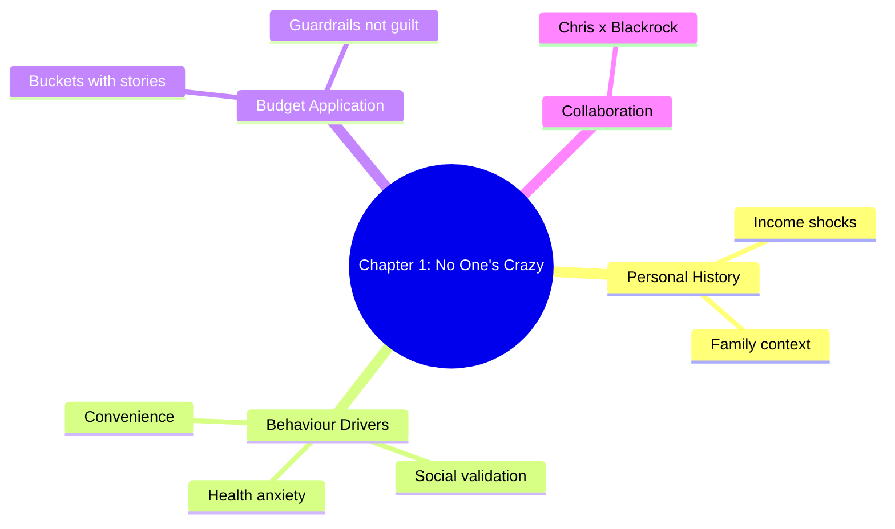

---
tags:
  - life/books
  - book/psychology-of-money
author: Morgan Housel
agent: Chris
status: in-progress
---

# The Psychology of Money Journal

Chris collaborates with Blackrock to translate each chapter’s behavioral finance lessons into real actions tied to your budget plan.

## Tracking Table
| Chapter | Title | Status | Link to Budget Plan |
| --- | --- | --- | --- |
| 1 | No One’s Crazy | ✅ Summarised | Mapped to Nov 2025 overspend |
| 2 | Luck & Risk | ✅ Summarised | December buffer plan |
| 3 | Never Enough | ⏳ Pending |  |
| ... | ... | ... | ... |

---

## Chapter 1 — No One’s Crazy

### Hero Narrative (Finance Lens)
You’re navigating the “Budget Bazaar.” Every shopper has different baggage: family expectations, past wins/losses, income shocks. Your recent spend spike (Lifestyle + Healthcare) isn’t madness—it’s your experience reacting to stress, health, and social needs. Recognizing this removes shame and lets Blackrock redesign the stalls (budget buckets) with empathy.

### Core Summary
- People’s financial decisions are shaped by their unique experiences; what seems irrational to one is normal to another.
- A budget isn’t purely math—it needs psychological guardrails (caps, routines, narratives).
- The goal is to understand personal triggers (social weekends, healthcare fears) and design systems that guide them.

### Mind Map

### Workflow Integration with Blackrock
1. **Identify Triggered Lines**: Drinks, healthcare/supps, Joyful Living.
2. **Assign Narratives**:
   - Drinks = “Weekend connection but cap to protect long-term mission.”
   - Healthcare = “Invest in resilience; differentiate need vs. impulse.”
   - Subscriptions = “Entertainment is fine, but curated—not autopilot.”
3. **Design Guardrails**: Use the Budget Plan caps (freeze Lifestyle, audit healthcare, trim transfers) while acknowledging the “why” behind each overshoot.
4. **Check Emotion vs Data**: Weekly ledger review: highlight entries tagged `#review` and ask, “What emotion drove this? How do we design for it?”

### Real-Time Action Plan
| Category | Insight | System Adjustment |
| --- | --- | --- |
| Drinks/Dining | Social validation triggered overspend | Plan intentional outings, pre-commit ₹3k cap |
| Healthcare/Supps | Health anxiety, experimentation | Separate prescription vs optional; move optional to Growth buffer |
| Joyful + OTT | FOMO after events (Comic Con, subs) | Keep 2 OTT platforms max; list reasons before adding new |
| Transfers | Generosity vs personal runway | Pause & review after Blackrock alerts before sending large transfers |

### Chris Notes
- Identity line: “I’m a thoughtful investor who designs systems for my future self.”
- Homework: For each overspend category, journal the context (who/what/feeling). Feed those notes to Blackrock weekly.
- Next chapter (Luck & Risk) will evaluate how randomness (unexpected expenses, extra income) should be handled without emotional swings.

---

## Chapter 2 — Luck & Risk

### Hero Narrative (Variance Dashboard)
You and Blackrock are co-pilots of a two-dial dashboard: **Luck** (tailwinds like surprise consulting payouts, family transfers, tax refunds) and **Risk** (unplanned healthcare, impulse gear buys, social weekends). November proved that relying on “good luck will cover it” leads to stress; December’s plan builds buffers so variance feels manageable, not chaotic.

### Core Summary
1. **Outcomes are path-dependent**: A few lucky breaks or unlucky hits can tilt the entire month; treat them as part of the design, not anomalies.
2. **Survivorship bias**: Comparing yourself to influencers who “always invest flawlessly” hides the unseen risks they dodged. Focus on your data.
3. **Margin of safety**: Budgets need slack (buffer + emergency cash) so random hits don’t derail mission-critical goals.

### Luck-Risk Mapping (Real Ledger Data)
| Event Type | Recent Example | Response | Adjustment in Dec Plan |
| --- | --- | --- | --- |
| Positive Luck | ₹18k reimbursement + side-gig inflow | Mostly sat idle in checking | Route 60% to Emergency, 40% to Sinking funds within 24h |
| Negative Luck | Sudden healthcare + lifestyle spikes | Swiped credit + delayed logging | Create `Health-Buffer` line (₹5k) before discretionary spend |
| Behavioral Risk | Late-night food/OTT stacking | Rationalized as “small” | Use Jarvis prompt to reflect on emotion, then log under Joyful cap |
| Opportunity Risk | Delay in investing surplus | Money drifted to zero-return cash | Schedule auto-transfer to index fund after each paycheck |

### Workflow with Blackrock
1. **Variance Triage**: On ledger review day, tag each irregular transaction `#luck` or `#risk`. This builds historical ratios.
2. **Buffer Automation**: Keep ₹10k liquid for “bad variance,” separate from emergency fund. When luck shows up, refill this first.
3. **Decision Rules**:
   - *If* UPI credit ≥ ₹5k unexpected → split per 60/40 rule above.
   - *If* healthcare or lifestyle hit exceeds cap → pause discretionary transfers for 48h, revisit need vs want.
4. **Narrative Update**: Tell yourself “I expect variance.” It removes the guilt spiral and lets you respond with process, not panic.

### Real-Time Action Plan
- Add a “Luck & Risk” block at the top of `Budget Analysis - 2025-11-11` to log each new deviation.
- Before executing the December backup push, run pre-check on the ledger: buffer funded? risk tags cleared?
- During weekly reviews with Chris + Blackrock, simulate one lucky event and one risky event; confirm the plan covers both without emotional turbulence.

### Chris Notes
- Keep reinforcing: “Skill is what you control; outcomes mix skill + variance.”
- Share the tagged ledger with Blackrock every Friday so the agent can recalibrate caps if risk runs >20% of income.
- Next chapter will examine “Never Enough,” so gather notes on where abundance still feels scarce (gadgets, gifts, lifestyle creep).

---

### Real-Time Narrative — Finance Variance Loop
| Moment | Reality Check | Luck/Risk Tag | Action in the Moment | Follow-Up |
| --- | --- | --- | --- | --- |
| Monday 8:15 AM | Parent sends surprise ₹5k transfer | #luck | Route 3k to Emergency, 2k to Sinking fund before breakfast | Note gratitude + purpose in ledger so it’s not absorbed by Lifestyle |
| Wednesday 11:45 PM | Late-night Swiggy + movie add ₹1k | #risk | Record spend + mood (“bored/tired”), leave cart closed for add-ons | During Friday review, decide if Joyful cap needs pre-commit or detox |
| Friday 4:00 PM | Client pays variable bonus | #luck | Apply 60/40 split instantly; screenshot confirmation for Blackrock | Schedule auto-invest of 40% within 24h to prevent drift |
| Saturday 2:30 PM | Friend asks for short-term loan | #risk | Check buffer status before replying; offer timeline only if buffer intact | Log as “transfer-risk” so Chris/Blackrock discuss boundary rules |
| Sunday 7:00 PM | Noticed healthcare meds out-of-stock, ₹3k refill | #risk (planned) | Use Health-Buffer line, then snap photo of receipt for tracking | Refill buffer from next inflow before discretionary spends resume |

Keeping this narrative live inside the Psychology journal ensures Blackrock’s budgeting instructions feel grounded in the exact curveballs you juggle every week.

### Lifestyle Quest Finance Blueprint (Defender + House, High-End Targets)
| Pillar | Target | Habit/Agent Loop | Financial Rule |
| --- | --- | --- | --- |
| **Defender Reserve** | ₹1.32 cr (₹1.10 cr ex-showroom + ₹22 L duties/insurance/upfits) | Jarvis hunts revenue plays (senior-consulting retainers, executive coaching pods, AI ops packages). Atomic Habit = “log one monetization idea daily.” | 50% of every side inflow auto-routed to `Goal-Defender`; invest excess in short-term debt/arb funds. Once corpus crosses ₹25 L, ladder into liquid debt + 12-month T-bills. |
| **House Fund** | ₹2.2 cr total; need ₹55 L cash (down payment + interiors + closing buffer) before loan | Blackrock enforces ₹4.6 L/year surplus (₹38k/month) minimum. Habit = nightly ledger close with `#homeproof` tag when spending protects runway. | Stage 1: build ₹15 L emergency + buffer. Stage 2: SIP ₹1.5 L/month into balanced advantage + index funds earmarked for house. Luck inflows → 80% House, 20% Defender until down payment secured. |
| **Lifestyle Guardrails** | Maintain current routines without drift | Chris monitors identity votes; if Lifestyle overshoot >10%, pause discretionary transfers for 2 weeks and add Jarvis experiment focused on high-margin service. | Monthly review: if Defender/House runway slips >5%, trim Joyful/OTT cap by ₹5k and reroute to goals until green. |
| **Risk Cushion** | ₹10k rapid buffer + ₹3 L emergency before EMI commitments | Psychology Chapter 2 mindset: expect variance. | Rule: No vehicle booking or property token until cushion funded + three simulated EMIs paid inside ledger without stress. |

**Execution Flow**
1. **Jarvis → Revenue Engine**: Weekly jam to validate one monetization idea (e.g., Deloitte-adjacent strategic sprint, Obsidian knowledge pack, real-estate scouting service). Target ₹60–75k net/month new cash flow dedicated to goals.
2. **Blackrock → Allocation Discipline**: Apply Luck/Risk tags, then immediately split inflows per Defender/House ratios before Lifestyle sees the balance. Automate SIP dates right after salary hits.
3. **Chris → Habit Proof**: During weekly atomic review, ask “Did I cast votes for ₹1.32 cr Defender + ₹2.2 cr home today?” If not, redesign cues (e.g., put Jarvis monetization prompt next to lunch, set phone reminder for ledger close).
4. **Monthly Board**: Obsidian dashboard card showing % funded (Defender corpus vs ₹1.32 cr, House cash vs ₹55 L), buffer status, top Jarvis revenue bet, and last three Luck/Risk events. This keeps the numbers visible, realistic, and emotionally anchored.

---

## 40-Year-old Runway Blueprint (4323-Day Sprint)

### Context
- **Age now**: 28; **Day-zero horizon**: 4,323 days (~11.8 years) until your 40th birthday.
- **Current engine**: Deloitte senior-consultant salary (base + bonus), side gigs, Jarvis-led idea sprints.
- **Goal**: 10× lifestyle optionality (Defender + House funded, investments compounding, flexible work-play design).

### Phase Map (Blackrock Steps + Atomic Habits Votes)
| Phase | Days | Focus | Atomic Habit Identity | Blackrock Financial Rule | Jarvis Output |
| --- | --- | --- | --- | --- | --- |
| **Stability** | 0–365 | Shore up buffers, track flawlessly | “I’m the allocator who never lets cash drift.” Nightly ledger close + emotion tag. | Build ₹15 L emergency, clear all high-interest debt, simulate 3 EMI payments. | One “cash-flow lever” idea/month (e.g., Deloitte-adjacent workshop) – execute at least 2 per year. |
| **Acceleration** | 366–2190 (Years 2–6) | Build ₹55 L house corpus + ₹25 L Defender seed while investing 35% of take-home | “I’m the architect who stacks assets before lifestyle flashes.” Use habit stacking: ledger review → SIP confirm. | Minimum 35% savings rate (salary + bonuses). Every raise: 70% to investments, 20% lifestyle, 10% learning. | Launch one high-ticket product/year (knowledge pack, cohort, AI ops retainer) targeting ₹6–9 L incremental income annually. |
| **Expansion** | 2191–3650 (Years 6–10) | Acquire house, close Defender fund, pivot to passive income build | “I’m the owner-operator who keeps systems lean post-upgrade.” Maintain weekly financial review. | Cap fixed expenses ≤50% of post-loan income. Invest any surplus in index + real estate syndicates. Target ₹1 cr invested corpus by Day 3650. | Jarvis explores scalable bets: real-estate scouting service, digital asset portfolio, strategic angel bets. |
| **Optionality** | 3651–4323 (Years 10–11.8) | Multiplying freedom: career design, geographic play, partner/family planning | “I’m the citizen who designs time, not just money.” Keep habit scoreboard for health, wealth, relationships. | Maintain 2-year cash runway, 60/40 equity-debt mix, and annual rebalancing with Blackrock. | Jarvis curates “freedom projects” (venture studio, impact fund, boutique gym) – vet for alignment, not just ROI. |

### Financial Principles (Chris + Blackrock)
1. **Rule of Re-allocation**: Every ₹1 earned already has a job (Defender, House, Freedom Fund, Buffer). Idle money equals lost compounding.
2. **Variance Normalization** (Psychology Chapter 2): Expect 3–4 surprise hits per year. Before upgrading lifestyle, confirm Luck/Risk ledger shows ≥2 buffers refilled.
3. **Identity Ledger** (Atomic Chapter 2): Tag transactions by identity (`#athlete`, `#investor`, `#builder`, `#connector`). If a week lacks investor votes, pause discretionary spend until a new proof appears.
4. **Skill-to-Asset Loop**: At the end of each quarter, summarize one Deloitte skill you can convert into an IP asset. Jarvis drafts the offer, Blackrock sets pricing, Chris books the habit time to build it.

### Jarvis Idea Protocol
- **Weekly**: Brainstorm three “10× levers” (consulting product, digital subscription, partnership). Evaluate with Blackrock for margin, risk, and timeline.
- **Monthly**: Choose one to pilot; define success metrics (₹, hours, repeatability).
- **Quarterly**: Retire ideas failing margin test; double down on those showing 30%+ net margin.

### Checkpoints
| Date | Milestone | Proof Artifact |
| --- | --- | --- |
| Day 365 | Emergency fund + EMI simulation complete | Screenshot in Budget Analysis + note in Atomic Habit tracker |
| Day 1825 | House corpus ≥ ₹30 L, Defender corpus ≥ ₹15 L | Ledger snapshot + Jarvis revenue log |
| Day 2920 | Property booked, Defender fund 75% ready | Contract copies + identity reflection |
| Day 3650 | ₹1 cr invested corpus, lifestyle EMI <50% income | Blackrock dashboard export |
| Day 4323 | Freedom Runway Plan signed off (2-yr buffer, multi-income) | Combined agent report (Chris summary, Blackrock numbers, Jarvis pipeline) |

This blueprint lets Chris keep Chapter 2 alive daily while Blackrock handles the math and Jarvis supplies scalable ideas—ensuring the Defender + House dream folds into a 10× life by 40 without derailing current identity systems.
