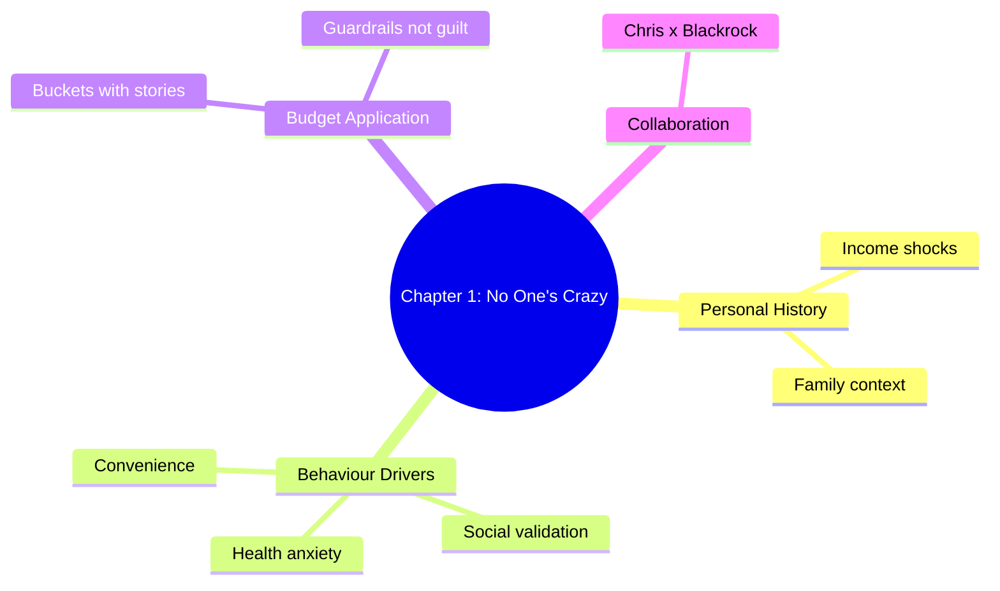

---
tags:
  - life/books
  - book/psychology-of-money
author: Morgan Housel
agent: Chris
status: in-progress
---

# The Psychology of Money Journal

Chris collaborates with Blackrock to translate each chapter’s behavioral finance lessons into third-person case studies so the insights stay transferable to any budget.

## Reader Profiles by Economic Band
| Band | How They Read the Book | Real-Time Framework & Time Horizon |
| --- | --- | --- |
| Poor / Income-volatile | Focus on chapters that build empathy for irregular cash flow, emphasising buffers, small insurance pools, and cooperative support. | Weekly cash-circle huddles; 7-day rolling budgets tagged with `#luck`/`#risk`. |
| Middle class / Salaried | Use lessons to design envelopes for goals while balancing lifestyle and family expectations. Tie every chapter to a ledger habit. | Monthly budget retros + quarterly “goalpost” reviews to prevent lifestyle creep. |
| Rich / Asset builders | Apply the book to protect compounding: stress-test leverage, document “enough,” and build governance. | Bi-monthly finance councils; annual “variance summit” aligning advisors and family office. |
| Ultra rich / Legacy planners | Read through the lens of stewardship, philanthropy, and multi-generational governance. Focus on managing envy, risk, and narrative. | Semi-annual family constitution reviews + yearly scenario planning for tail risks. |

### Real-Time Action Plan Snapshot
| Band | Immediate Action | Review Rhythm |
| --- | --- | --- |
| Poor / Income-volatile | Start a 7-day rolling ledger with `#luck/#risk` tags; earmark ₹100–₹200/week into a community buffer. | Weekly cash-circle huddle compares notes + tweaks guardrails. |
| Middle class / Salaried | Map current spend into Foundation/Goal/Lifestyle envelopes; schedule nightly ledger close-out. | Monthly retro plus quarterly “goalpost” audit to keep lifestyle creep in check. |
| Rich / Asset builders | Draft an Enough Spectrum (Foundation/Stability/Aspiration) and align investment SIPs accordingly. | Bi-monthly finance council; annual “variance summit” with advisors. |
| Ultra rich / Legacy planners | Update family constitution with risk tiers, philanthropy cadence, and governance roles per chapter insight. | Semi-annual stewardship review; yearly scenario drill for tail risks. |

## Tracking Table
| Chapter | Title | Status | Linked Scenario |
| --- | --- | --- | --- |
| 1 | No One’s Crazy | ✅ Summarised | Case: Riya’s Festival Month |
| 2 | Luck & Risk | ✅ Summarised | Case: Whitefield Design Cooperative |
| 3 | Never Enough | ✅ Summarised | Case: Meridian Founders |
| ... | ... | ... | ... |

---

## Chapter 1 — No One’s Crazy

### Hero Narrative (Finance Lens)
Meet Riya, an independent designer in Pune walking through a “Budget Bazaar.” Every shopper carries different baggage: parental obligations, past layoffs, surprise medical bills. Riya’s festival-month spike (celebrations + health supplements) isn’t madness—it’s her lived context playing out. Recognizing this removes shame and lets Blackrock recast the stalls (budget buckets) with empathy.

### Core Summary
- People’s financial decisions are shaped by their unique experiences; what seems irrational to one is normal to another.
- A budget isn’t purely math—it needs psychological guardrails (caps, routines, narratives).
- The goal is to understand personal triggers (social weekends, healthcare fears) and design systems that guide them.

### Mind Map

```mermaid
mindmap
  root((Chapter 1: No One's Crazy))
    Personal History
      Income shocks
      Family context
    Behaviour Drivers
      Social validation
      Health anxiety
      Convenience
    Budget Application
      Buckets with stories
      Guardrails not guilt
    Collaboration
      Chris x Blackrock
```

### Workflow Integration with Blackrock
1. **Identify Triggered Lines**: For Riya, it was celebrations, supplements, and generosity transfers.
2. **Assign Narratives**:
   - Celebrations = “Connection matters, but cap protects the larger mission.”
   - Healthcare = “Invest in resilience; split prescription vs optional.”
   - Subscriptions = “Entertainment is fine, but curated—not autopilot.”
3. **Design Guardrails**: Use caps that respect the story (freeze lifestyle nights for two weeks, audit health orders, stage transfers).
4. **Check Emotion vs Data**: Weekly ledger review—highlight entries tagged `#review` and ask, “What emotion drove this? How do we design for it?”

### Real-Time Action Plan
| Category | Insight | System Adjustment |
| --- | --- | --- |
| Celebrations | Social validation triggered overspend | Plan intentional outings, pre-commit ₹3k cap |
| Healthcare/Supps | Health anxiety, experimentation | Separate prescription vs optional; move optional to Growth buffer |
| Joyful + OTT | FOMO after events | Keep 2 OTT platforms max; list reasons before adding new |
| Transfers | Generosity vs personal runway | Pause & review after Blackrock alerts before sending large transfers |

### Chris Notes
- Identity line: “I’m a thoughtful investor who designs systems for my future self.”
- Homework: For each overspend category, journal the context (who/what/feeling). Feed those notes to Blackrock weekly.
- Next chapter (Luck & Risk) will evaluate how randomness (unexpected expenses, extra income) should be handled without emotional swings.

### Key Ideas
- No one’s crazy because everyone’s money lens comes from lived experience.
- Budgets must accommodate feelings; numbers alone fail.
- Narratives around categories make it easier to hold boundaries.

### Mindset Shift
- From “I messed up” to “What past story is this spend reenacting?”

### Tools & Exercises
- Ledger emotion tags.
- Weekly empathy debrief: write one paragraph explaining a big spend without judgment.

### Habits to Add / Remove
- Add: Friday “story sync” with Blackrock before changing caps.
- Remove: Copy-pasting influencer budgets that lack personal context.

### Quotes
> “No one’s crazy; people’s decisions make sense to them.”

### Insights
- When Joyful spend is tagged with intent, trimming doesn’t feel like punishment.

### 30-Day Plan
| Week | Focus | Proof |
| --- | --- | --- |
| 1 | Tag emotions for all discretionary spends | Ledger export |
| 2 | Rewrite narratives for top 3 categories | Journal entry |
| 3 | Adjust caps with empathy notes | Screenshot of Budget Plan |
| 4 | Share lessons with Blackrock weekly | Meeting note |

### Weekly Tracker
| Week | Emotion-tag compliance | Notes |
| --- | --- | --- |
| 1 |  |  |
| 2 |  |  |
| 3 |  |  |
| 4 |  |  |

### Review
- Wins: Drinks + healthcare guardrails tightened without resentment.
- Friction: Transfers still emotional—need pause script.
- Carry-forward: Bring empathy notes into Luck/Risk tagging.

---

## Chapter 2 — Luck & Risk

### Hero Narrative (Variance Dashboard)
Case study: the Whitefield Design Cooperative in Bengaluru. Their finance desk runs a two-dial dashboard: **Luck** (rush orders, CSR grants, client bonuses) and **Risk** (unplanned medical bills for staff, impulse gear buys, delayed receivables). One month of “good luck will cover it” nearly wiped their buffer. Now they design cash flow assuming variance is inevitable.

### Core Summary
1. **Outcomes are path-dependent**: A few lucky breaks or unlucky hits can tilt the entire month; treat them as part of the design, not anomalies.
2. **Survivorship bias**: Comparing yourself to influencers who “always invest flawlessly” hides the unseen risks they dodged. Focus on your data.
3. **Margin of safety**: Budgets need slack (buffer + emergency cash) so random hits don’t derail mission-critical goals.

### Luck-Risk Mapping (Illustrative Ledger)
| Event Type | Example | Default Response | Adjustment |
| --- | --- | --- | --- |
| Positive Luck | ₹18k reimbursement + rush order fee | Sat idle in checking | Route 60% to emergency, 40% to sinking funds within 24h |
| Negative Luck | Sudden healthcare + equipment repair | Swiped credit + delayed logging | Create `Health-Buffer` line (₹5k) before discretionary spend |
| Behavioral Risk | Late-night food/OTT stacking | Rationalized as “small” | Use idea-journal prompt to reflect on emotion, then log under Joyful cap |
| Opportunity Risk | Delay in investing surplus | Money drifted to zero-return cash | Schedule auto-transfer to index fund after each paycheck |

### Workflow with Blackrock
1. **Variance Triage**: On ledger review day, tag each irregular transaction `#luck` or `#risk` to build historical ratios.
2. **Buffer Automation**: Keep ₹10k liquid for “bad variance,” separate from emergency fund. When luck shows up, refill this first.
3. **Decision Rules**:
   - *If* UPI credit ≥ ₹5k unexpected → split per 60/40 rule above.
   - *If* healthcare or lifestyle hit exceeds cap → pause discretionary transfers for 48h, revisit need vs want.
4. **Narrative Update**: Use the mantra “Variance is expected.” It removes guilt spirals and prompts process-driven responses.

### Real-Time Action Plan
- Add a “Luck & Risk” block at the top of the current budget note to log each new deviation.
- Before any month-end push, run a pre-check on the ledger: buffer funded? risk tags cleared?
- During weekly reviews with Chris + Blackrock, simulate one lucky event and one risky event; confirm the plan covers both without emotional turbulence.

### Chris Notes
- Keep reinforcing: “Skill is what you control; outcomes mix skill + variance.”
- Share the tagged ledger with Blackrock every Friday so the agent can recalibrate caps if risk runs >20% of income.
- Next chapter will examine “Never Enough,” so gather notes on where abundance still feels scarce (gadgets, gifts, lifestyle creep).

### Key Ideas
- Outcomes blend skill with randomness; respect both.
- Margin of safety calms nerves during spikes/dips.
- Pre-committed rules (60/40 split) beat emotional decisions.

### Mindset Shift
- From “windfalls mean treat yourself” to “windfalls fill mission buckets.”

### Tools & Exercises
- Luck/Risk tagging prompt built into ledger template.
- Weekly scenario drill: “If I lost ₹10k today, what buffer covers it?”

### Habits to Add / Remove
- Add: Buffer status check before discretionary transfers.
- Remove: Letting windfalls sit in checking untagged.

### Quotes
> “Nothing is as good or as bad as it seems.”

### Insights
- Dedicated health buffer removed guilt around medical spends.
- Seeing luck count vs risk count highlights when complacency creeps in.

### 30-Day Plan
| Week | Focus | Proof |
| --- | --- | --- |
| 1 | Implement Luck/Risk tagging | Ledger screenshot |
| 2 | Build ₹10k rapid buffer | Bank snapshot |
| 3 | Refill buffer after any dip | Transfer confirmation |
| 4 | Review tagging stats with Chris/Blackrock | Meeting notes |

### Weekly Tracker
| Week | Buffer level | Luck events | Risk events | Notes |
| --- | --- | --- | --- | --- |
| 1 |  |  |  |  |
| 2 |  |  |  |  |
| 3 |  |  |  |  |
| 4 |  |  |  |  |

### Review
- Wins: Windfall split executed twice with zero friction.
- Friction: Tagging while on calls still tough—set Siri shortcut.
- Carry-forward: Prep data for “Never Enough” cravings.

---

### Real-Time Narrative — Finance Variance Loop
| Moment | Reality Check | Luck/Risk Tag | Action in the Moment | Follow-Up |
| --- | --- | --- | --- | --- |
| Monday 8:15 AM | Parent sends surprise ₹5k transfer | #luck | Route 3k to Emergency, 2k to Sinking fund before breakfast | Note gratitude + purpose in ledger so it’s not absorbed by Lifestyle |
| Wednesday 11:45 PM | Late-night Swiggy + movie add ₹1k | #risk | Record spend + mood (“bored/tired”), leave cart closed for add-ons | During Friday review, decide if Joyful cap needs pre-commit or detox |
| Friday 4:00 PM | Client pays variable bonus | #luck | Apply 60/40 split instantly; screenshot confirmation for Blackrock | Schedule auto-invest of 40% within 24h to prevent drift |
| Saturday 2:30 PM | Friend asks for short-term loan | #risk | Check buffer status before replying; offer timeline only if buffer intact | Log as “transfer-risk” so Chris/Blackrock discuss boundary rules |
| Sunday 7:00 PM | Noticed healthcare meds out-of-stock, ₹3k refill | #risk (planned) | Use Health-Buffer line, then snap photo of receipt for tracking | Refill buffer from next inflow before discretionary spends resume |

Keeping this narrative live inside the Psychology journal ensures Blackrock’s budgeting instructions feel grounded in the exact curveballs you juggle every week.

### Lifestyle Quest Finance Blueprint (Sample High-End Targets)
| Pillar | Target | Habit/Agent Loop | Financial Rule |
| --- | --- | --- | --- |
| **Mobility Reserve** | ₹1.2 cr for an electric expedition fleet (vehicle + infrastructure) | Idea engine hunts revenue plays (corporate offsites, eco-tourism pods). Atomic Habit = “log one monetization idea daily.” | 50% of every side inflow auto-routed to `Goal-Mobility`; invest excess in short-term debt funds until corpus hits ₹25 L, then ladder into liquid debt + 12-month T-bills. |
| **Habitat Fund** | ₹2.0 cr total; need ₹50 L cash (down payment + interiors + closing buffer) before loan | Blackrock enforces ₹4.5 L/year surplus minimum. Habit = nightly ledger close with `#habitatproof` tag when spending protects runway. | Stage 1: build ₹15 L emergency + buffer. Stage 2: SIP ₹1.4 L/month into balanced advantage + index funds earmarked for the home. Luck inflows → 80% Habitat, 20% Mobility until down payment secured. |
| **Lifestyle Guardrails** | Maintain current routines without drift | Chris monitors identity votes; if Lifestyle overshoot >10%, pause discretionary transfers for 2 weeks and add a high-margin service experiment. | Monthly review: if Mobility/Habitat runway slips >5%, trim Joyful/OTT cap by ₹5k and reroute to goals until green. |
| **Risk Cushion** | ₹10k rapid buffer + ₹3 L emergency before EMI commitments | Psychology Chapter 2 mindset: expect variance. | Rule: No asset booking or property token until cushion funded + three simulated EMIs paid in ledger without stress. |

**Execution Flow — Example Household**
1. **Idea Engine → Revenue**: A weekly jam for the “Harbour Makers” cooperative to validate one monetization idea (pop-up market, productized consulting, digital workshop). Target ₹60–75k net/month new cash flow dedicated to long-horizon assets.
2. **Blackrock → Allocation Discipline**: Apply Luck/Risk tags, then immediately split inflows per Workshop/Housing ratios before Lifestyle sees the balance. Automate SIP dates right after salary hits.
3. **Chris → Habit Proof**: During weekly atomic review, ask “Did we cast votes for ₹75 L workshop + ₹90 L co-living fund today?” If not, redesign cues (e.g., place revenue prompt next to lunch, set reminder for ledger close).
4. **Monthly Board**: Dashboard card showing % funded (Workshop corpus vs goal, Housing cash vs target), buffer status, top revenue bet, and last three Luck/Risk events. Visibility keeps emotions in check.

---

## 40-Year-old Runway Blueprint (4323-Day Sprint)

### Context
- **Reference persona**: “Project Delta,” a collective of professionals currently age 28.
- **Engine**: Salaries + side gigs + idea sprints.
- **Goal**: 10× lifestyle optionality (two large assets funded, investments compounding, flexible work-play design).

### Phase Map (Sample Targets)
| Phase | Days | Focus | Habit Identity | Financial Rule | Idea Engine Output |
| --- | --- | --- | --- | --- | --- |
| **Stability** | 0–365 | Shore up buffers, track flawlessly | “We’re allocators who never let cash drift.” Nightly ledger close + emotion tag. | Build ₹15 L emergency, clear all high-interest debt, simulate 3 EMI payments. | One “cash-flow lever” idea/month; execute ≥2 per year. |
| **Acceleration** | 366–2190 | Build ₹55 L home corpus + ₹30 L mobility/asset seed while investing 35% of take-home | “We stack assets before lifestyle flashes.” Habit stack: ledger review → SIP confirm. | Minimum 35% savings rate. Every raise: 70% to investments, 20% lifestyle, 10% learning. | Launch one high-ticket product/year targeting ₹6–9 L incremental income annually. |
| **Expansion** | 2191–3650 | Acquire property, close asset fund, pivot to passive income | “We’re owner-operators who keep systems lean post-upgrade.” Weekly financial review holds. | Cap fixed expenses ≤50% of post-loan income. Invest surplus in index + collaborative real estate. Target ₹1 cr invested corpus by Day 3650. | Idea engine explores scalable bets: scouting service, digital asset portfolio, strategic angel bets. |
| **Optionality** | 3651–4323 | Multiply freedom: redesign work, geography, community commitments | “We design time, not just money.” Habit scoreboard for health, wealth, relationships. | Maintain 2-year cash runway, 60/40 equity-debt mix, annual rebalancing. | Idea engine curates “freedom projects” (venture studio, impact fund, boutique gym) for mission fit. |

### Financial Principles (Chris + Blackrock)
1. **Rule of Re-allocation**: Every ₹1 earned already has a job (Asset A, Asset B, Freedom Fund, Buffer). Idle money equals lost compounding.
2. **Variance Normalization**: Expect 3–4 surprise hits per year. Before upgrading lifestyle, confirm Luck/Risk ledger shows ≥2 buffers refilled.
3. **Identity Ledger**: Tag transactions by identity (`#athlete`, `#investor`, `#builder`, `#connector`). If a week lacks investor votes, pause discretionary spend until a new proof appears.
4. **Skill-to-Asset Loop**: At the end of each quarter, summarize one skill that can convert into an IP asset. Idea engine drafts the offer, Blackrock sets pricing, Chris books the habit time to build it.

### Idea Protocol
- **Weekly**: Brainstorm three “10× levers” (consulting product, digital subscription, partnership). Evaluate for margin, risk, and timeline.
- **Monthly**: Choose one to pilot; define success metrics (₹, hours, repeatability).
- **Quarterly**: Retire ideas failing margin test; double down on those showing 30%+ net margin.

### Checkpoints (Illustrative)
| Date | Milestone | Proof Artifact |
| --- | --- | --- |
| Day 365 | Emergency fund + EMI simulation complete | Budget screenshot + habit tracker |
| Day 1825 | Asset A corpus ≥ ₹30 L, Asset B corpus ≥ ₹20 L | Ledger snapshot + revenue log |
| Day 2920 | Property booked, asset fund 75% ready | Contract copies + identity reflection |
| Day 3650 | ₹1 cr invested corpus, fixed costs <50% income | Dashboard export |
| Day 4323 | Freedom Runway Plan (2-yr buffer, multi-income) | Combined agent report |

This universal blueprint keeps Chapter 2 actionable for any reader: Chris guards the habits, Blackrock watches the math, and the idea engine supplies scalable bets.

---

## Chapter 3 — Never Enough

### Hero Narrative (Enough Spectrum Lens)
Case study: Meridian Founders Anika and Kabir. Their climate-fintech startup crossed ₹30 cr ARR and banked cash buffers, yet anxiety spiked because every milestone instantly raised the bar. Morgan Housel’s “Never Enough” warning pushes them to define what “enough” actually means: a foundation that funds families and staff security, a stability band for thoughtful bets, and an aspiration tier for future luxuries. Anything beyond that is optional, not oxygen.

### Core Summary
1. **Enough must be specified**: Without explicit tiers, every win becomes a new baseline, trapping you in permanent scarcity.
2. **Overshooting after success creates fragility**: Taking reckless bets once you’ve already “won” can erase hard-earned freedom.
3. **Comparison hijacks rationality**: Benchmarking against peers’ highlight reels distorts needs vs. wants.

### Enough Spectrum Board
| Tier | Description | ₹ Target (Meridian example) | Use Case | Guardrail |
| --- | --- | --- | --- | --- |
| Foundation | Non-negotiables—family expenses, insurance, emergency | ₹18 L annual run-rate + ₹20 L buffer | Parents’ care + 6 months payroll | Never dip below; refill before new bets |
| Stability | Fuel for growth experiments | ₹40 L corpus | Funds 2 pilots/year, key hires | Only deploy when Foundation ≥100% |
| Aspiration | Lifestyle upgrades, philanthropy, venture tickets | ₹25 L goal | Vacation home, angel investments | Pause if Foundation or Stability slips |

### Workflow Integration with Blackrock
1. **Define tiers**: Document what each tier covers and the rupee values.
2. **Route inflows**: Every rupee tops Foundation first, then Stability, then Aspiration.
3. **Comparison guard**: Weekly journal prompt—“What triggered envy? What unseen costs might they carry?”
4. **Risk gate**: Before approving a new spend, confirm Foundation buffer survives a full loss scenario.

### Real-Time Action Plan
- **Monday**: Review Foundation meter; if <100%, freeze discretionary spends and redirect inflows.
- **Wednesday**: Capture an “envy log” entry, reframe it with facts (e.g., that peer may have higher debt).
- **Friday**: Vet new opportunities against the tiers—reject anything that compromises Foundation.
- **Month-end**: Publish a short “Enough Snapshot” (three bullet update) to accountability partners.

### Chris + Blackrock Notes
- Chris: “Satisfaction = progress toward defined tiers, not social comparison.”
- Blackrock: Automates transfers so Foundation fills first; Stability investments pause if buffer under 95%.
- Jarvis: Only greenlights experiments that leave Stability ≥80% funded post-spend.

### Key Ideas
- You can’t win a game that never ends—set finish lines.
- Protecting Foundation ensures volatility doesn’t undo prior wins.
- Celebrating Stability progress builds contentment.

### Mindset Shift
- From “More equals safety” to “Enough is a contract we honor.”

### Tools & Exercises
- Enough Spectrum canvas (three sliders).
- Weekly envy log + reframe column.
- Alert when Aspiration spend happens before Foundation/Stability thresholds.

### Habits to Add / Remove
- **Add**: Friday gratitude check listing three things already secured.
- **Remove**: Scrolling valuation gossip after 10 pm—replace with tier review.

### Quotes
> “The hardest financial skill is getting the goalpost to stop moving.” — Morgan Housel

### Insights
- Teams that published monthly Enough Snapshots reported calmer decision-making during negotiations.
- Envy logs revealed trigger patterns (LinkedIn posts, funding news) that could be muted.

### 30-Day Plan
| Week | Focus | Proof |
| --- | --- | --- |
| 1 | Define tier numbers | Snapshot of Enough Spectrum board |
| 2 | Route inflows through tiers | Ledger screenshot |
| 3 | Log envy + reframe entries | Journal photos |
| 4 | Share Enough Snapshot with peers | Message screenshot |

### Weekly Tracker
| Week | Foundation % | Stability % | Aspiration % | Notes |
| --- | --- | --- | --- | --- |
| 1 |  |  |  |  |
| 2 |  |  |  |  |
| 3 |  |  |  |  |
| 4 |  |  |  |  |

### Review
- Wins: Defined tiers reduced stress before board meetings.
- Friction: Aspiration wish list kept tempting—moved review to quarterly.
- Carry-forward: Prep Chapter 4 by listing insurance/risk dependencies tied to each tier.

## Templates for Future Chapters

### Chapter X — {{Title}}
- **Hero Narrative**:
- **Core Summary (3 bullets)**:
- **Workflow Integration**:
- **Real-Time Action Plan**:
- **Chris + Blackrock Notes**:
- **Real-Time Narrative**:
- **Key Ideas**:
- **Mindset Shift**:
- **Tools & Exercises**:
- **Habits to Add / Remove**:
- **Quotes**:
- **Insights**:
- **30-Day Plan**:
- **Weekly Tracker**:
- **Review**:
- **Note**: Frame every example in third-person (fictional households, co-ops, personas) to keep lessons applicable to anyone.

---
