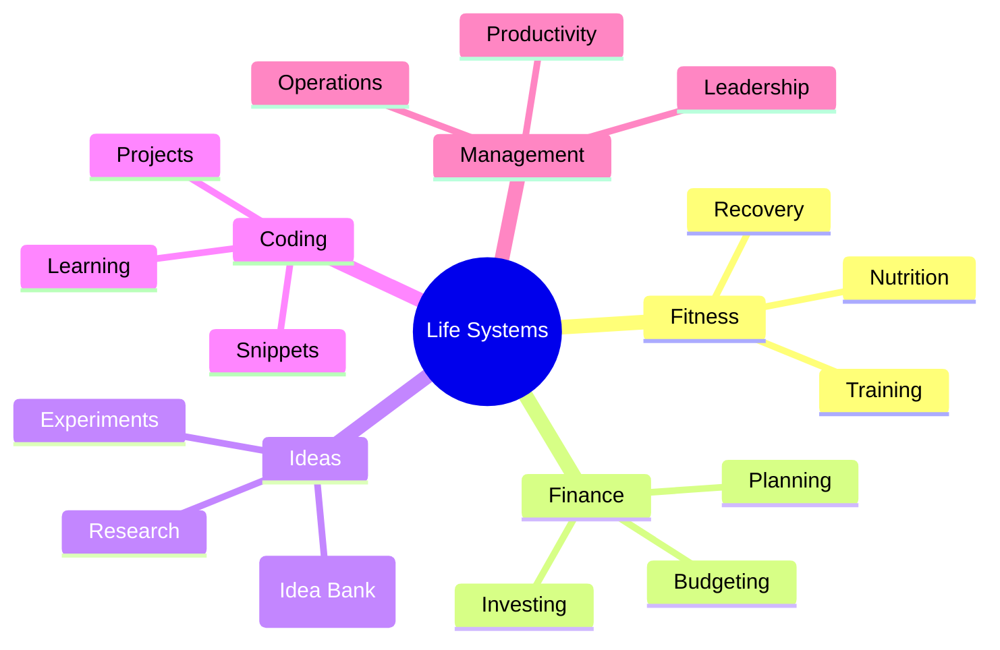

# Life Systems Map

```mermaid
mindmap
  root((Life Systems))
    Fitness
      Training
      Nutrition
      Recovery
    Finance
      Budgeting
      Investing
      Planning
    Ideas
      ("Idea Bank")
      Research
      Experiments
    Coding
      Learning
      Projects
      Snippets
    Management
      Productivity
      Leadership
      Operations
```

Use this mind map to visualize how each domain connects, then jump into the linked folders for detailed notes and workflows.
